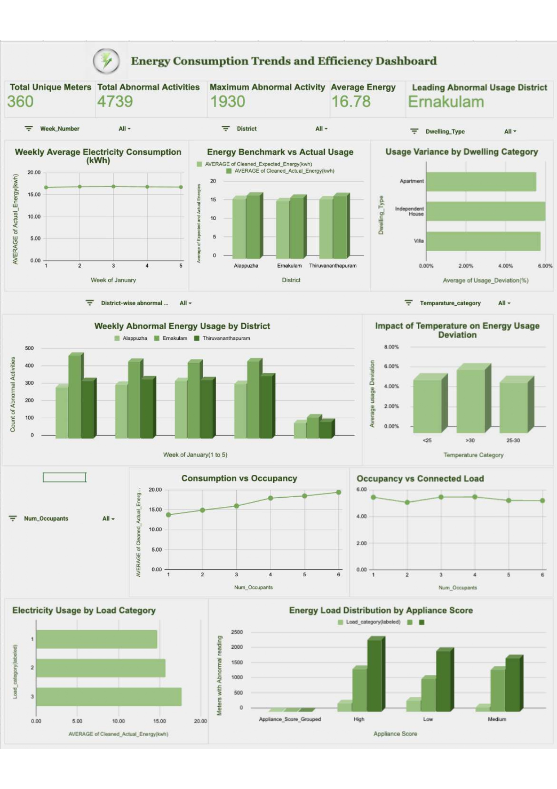

# Kerala Residential Electricity Anomaly Detection (January 2023)

## Project Overview

The objective of this project is to design a **district-level anomaly detection framework** for January residential electricity consumption in Kerala. The goal is to enable electricity authorities to identify high-risk consumers, prioritize inspection resources, and prevent operational losses proactively.

**Approach:**

* Analyze residential electricity data for Kerala for January 2023.
* Clean and preprocess data to ensure reliable records.
* Calculate **usage deviations** and cluster-level patterns to detect anomalies.
* Develop an **interactive dashboard** for monitoring abnormal consumption.

**Sector:** Energy & Utilities (Residential electricity consumption monitoring)

**Challenges:**

* Abnormal usage and demand fluctuations.
* Inefficient consumption patterns.
* Data inconsistencies and limited real-time anomaly detection.

**Scope:**

* Data cleaning and feature engineering.
* KPI computation (Usage Deviation, Cluster Averages).
* Pivot-based summaries and interactive dashboard.
* Excludes predictive model deployment.

**Success Criteria:**

* Accurate KPI and deviation calculations.
* Clear detection of abnormal consumption.
* Meaningful cluster segmentation.
* Insightful interactive dashboard.
* Actionable recommendations for energy management.

---

## Data Dictionary & Cleaning Notes

| Column                        | Description                          | Cleaning / Transformation                    |
| ----------------------------- | ------------------------------------ | -------------------------------------------- |
| Meter_Id                      | Numeric meter ID (prefix removed)    | Standardized IDs                             |
| Cleaned_Date                  | Date of energy record                | Standardized date format, weekday extraction |
| Week_number                   | Week of the month                    | Derived from date                            |
| District                      | Region name                          | Verified names                               |
| Labeled_Dwelling              | Type of residence                    | Labelled format                              |
| Num_Occupants                 | Number of residents                  | Checked for missing values                   |
| House_Area (sqft)             | Area of the house                    | Cleaned missing / extreme values             |
| Appliance_Score               | Intensity of appliance usage         | Categorized                                  |
| Appliance_Score_Grouped       | Grouped appliance intensity          | Created for segmentation                     |
| Connected_Load (kW)           | Maximum electrical load              | Checked consistency                          |
| Load_category                 | Categorized load                     | Derived from Connected_Load                  |
| Temperature_C                 | Recorded temperature                 | Verified numeric values                      |
| Temperature_category          | Categorized temp (<25, 25-30, >30)   | Derived from Temperature_C                   |
| Humidity (%)                  | Humidity level                       | Verified values                              |
| Cleaned_Expected_Energy (kWh) | Estimated energy                     | Missing values handled                       |
| Cleaned_Actual_Energy (kWh)   | Actual energy consumed               | Missing values handled                       |
| Usage_Deviation (%)           | Difference between actual & expected | Calculated, % format                         |
| Cluster_Avg_Energy (kWh)      | Cluster average energy               | Calculated per cluster                       |
| Abnormal_Usage                | Binary flag (1=abnormal,0=normal)    | Derived from deviation threshold             |
| Pattern_Usage                 | Usage behavior pattern               | Classified                                   |

**Data Size:** 10,800 records across multiple districts.
**Limitations:** Single month (Jan 2023), Kerala only, some initial missing values.

---

## Key KPIs & Metrics

| KPI                                 | Value     | Formula                                        | Purpose                              |
| ----------------------------------- | --------- | ---------------------------------------------- | ------------------------------------ |
| Total Unique Meters                 | 360       | COUNT(DISTINCT Meter_ID)                       | Total monitored consumers            |
| Total Abnormal Activities           | 4739      | SUM(Abnormal_Usage)                            | Measure irregular consumption events |
| Average Energy Consumption          | 16.78 kWh | AVERAGE(Cleaned_Actual_Energy)                 | Overall consumption level            |
| District with Max Abnormal Usage    | Ernakulam | MAX(SUM(Abnormal_Usage) by District)           | High-risk region identification      |
| Abnormal Activity Count – Ernakulam | 1930      | SUM(Abnormal_Usage WHERE District='Ernakulam') | Focused risk monitoring              |

---

## Dashboard Preview 

## Exploratory Data Analysis (EDA) Summary

**Trends:**

* Weekly average energy stable: 16.65–16.86 kWh.
* Ernakulam shows highest abnormal usage (1930), followed by Thiruvananthapuram (1467).

**Comparisons:**

* Independent houses have highest usage deviation (5.99%).
* Deviation highest at temperatures >30°C (6.37%).
* Actual energy slightly exceeds expected across all districts.

**Distributions:**

* Appliance score correlates with load category.
* Energy consumption increases with household size (13.75 → 19.40 kWh).

**Correlations:**

* Higher load category → higher actual energy.
* Occupants vs connected load: consumption driven by behavior, not infrastructure.

**Scenario Analysis:**

* Increase in occupants, load, or temperature → higher energy consumption & deviation.

---

## Advanced Insights & Recommendations

1. **Data-Driven Monitoring:**

   * Leverage cleaned data, deviation metrics, and cluster analysis for continuous anomaly detection.

2. **Real-Time Detection:**

   * Deploy monitoring to flag deviations early, reducing operational losses.

3. **Prioritize High-Risk Clusters:**

   * Focus inspections on high-load clusters, e.g., Ernakulam.

4. **Promote Energy Efficiency:**

   * Encourage efficient appliances and optimized connected load at the household level.

5. **Forecasting & Segmentation:**

   * Stable weekly consumption (~16.7 kWh). High deviation influenced by high temperatures and load intensity.

---

## Dashboard Summary

* **Interactive visuals**: district-wise abnormal usage, energy deviation trends, cluster averages.
* **KPIs at a glance**: Total meters, total abnormal activities, average energy, high-risk districts.
* **Segmentation filters**: By dwelling type, load category, temperature category, and week.
* **Actionable view**: Quickly identify high-risk consumers and clusters for inspection planning.

---

**Conclusion:**
The framework provides electricity authorities with a **data-driven, interactive, and actionable monitoring system** for residential energy anomaly detection in Kerala, enabling **proactive interventions and optimized resource allocation**.
